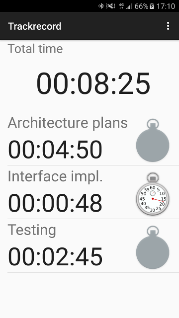
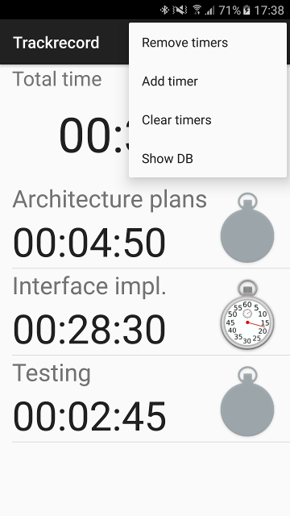

# Trackrecord
> *"the past achievements or performance of a person, organization, or product"*

Trackrecord is a simple time tracking application for Android. The app does not require any permissions and does not connect to the internet. The app is based on timestamps and does not need to be running to record time.

 
